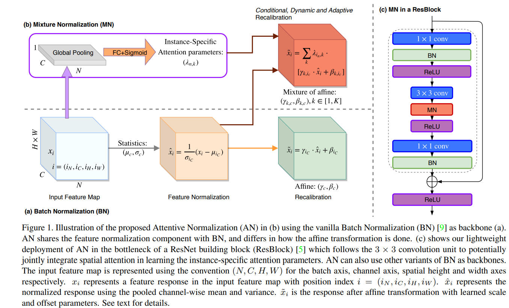

# Attentive Normalization
This repository is an unofficial Keras implementation of the paper [Attentive Normalization](https://arxiv.org/abs/1908.01259) by [Xilai Li](https://github.com/xilaili), [Wei Sun](https://github.com/WillSuen) and [Tianfu Wu](https://github.com/tfwu).

The official implementation will be released here : https://github.com/ivMCL/AttentiveNorm

## Introduction
Attentive Normalization (AN) is an attention-based version of BN which recalibrates channel information of BN. AN absorbs the [Squeeze-and-Excitation (SE) mechanism](https://arxiv.org/abs/1709.01507) into the affine transformation of BN. AN learns a small number of scale and offset parameters per channel (i.e., different affine transformations). Their weighted sums (i.e., mixture) are used in the final affine transformation. The weights are instance-specific and learned in a way that channel-wise attention is considered, similar in spirit to the squeeze module in the SE unit. This can be used as a droppin replacement of standard BatchNormalization layer. 

  

Please refer to the notebook for an usage example.
